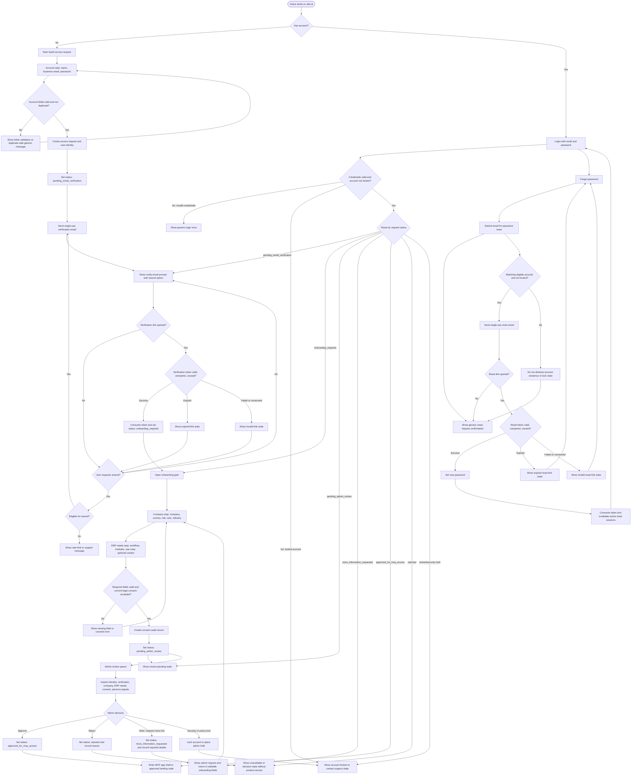

# Auth User Flow Map

Task: TASK-2026-01967 / UX-01
Project: PROJ-0130 abit_ai_website
Status: Draft for UX and implementation handoff

## Objective

Map the end-to-end abit.ai SaaS authentication user journey for new users, existing users, unverified users, password reset, and admin review. This flow is intended to guide UX wireframes, QA scenario design, and implementation tasks for the MVP authentication and access review scope.

## Source Context

- `docs/saas-auth-mvp-scope.md`
- `docs/signup-multi-step-flow-decision-record.md`
- `docs/signup-company-profile-field-dictionary.md`
- `docs/business-customer-personas-lead-qualification.md`
- `docs/legal-consent-privacy-capture-requirements.md`
- `docs/auth-analytics-funnel-event-taxonomy.md`
- Source brief named in ERP task: `PROJ-0130_abit_saas_auth_task_tree.md`

## Actors and States

| Actor or state | Meaning |
| --- | --- |
| New user | Visitor who starts the public SaaS access request flow. |
| Existing user | User with credentials who returns through login. |
| Unverified user | User whose access request exists but email has not been verified. |
| Pending-review user | Verified user who completed onboarding and is waiting for admin decision. |
| Approved user | User with `review_status = approved_for_mvp_access`. |
| Locked account | User blocked by security, admin action, excessive attempts, or policy hold. |
| Admin reviewer | Authorized admin who reviews submitted access requests. |

Canonical request statuses:

1. `pending_email_verification`
2. `onboarding_required`
3. `pending_admin_review`
4. `approved_for_mvp_access`
5. `rejected`
6. `more_information_requested`

## End-to-End Flow Diagram

## UX Flow Requirements

### New User

| Step | User experience | System behavior |
| --- | --- | --- |
| Start signup | User enters the public access request flow. | Emit signup start analytics once per attempt. |
| Account step | User submits full name, business email, and password. | Validate fields, prevent obvious duplicate active requests, create access request, create identity when credential signup is enabled. |
| Email verification | User sees a verify-email prompt with a resend option. | Store `pending_email_verification`, create a single-use expiring token, send email. |
| Verification success | User opens a valid link. | Consume token, set `email_verified_at`, advance to `onboarding_required`. |
| Onboarding | User completes Company and ERP needs steps and accepts current legal terms and privacy notices. | Validate required fields, create consent audit record, advance to `pending_admin_review`. |
| Review pending | User sees waiting-for-review state. | Product access remains blocked until admin approval. |
| Approved | User logs in after approval. | Route to MVP app shell or approved landing state. |

### Existing User

| Login condition | UX destination | System behavior |
| --- | --- | --- |
| Valid credentials and `pending_email_verification` | Verify-email prompt with resend option. | Do not grant product access. |
| Valid credentials and `onboarding_required` | Onboarding gate. | Allow only onboarding submission and account-safe actions. |
| Valid credentials and `pending_admin_review` | Review-pending state. | Keep product access blocked. |
| Valid credentials and `approved_for_mvp_access` | MVP app shell or approved landing state. | Create authenticated session. |
| Valid credentials and `more_information_requested` | Editable onboarding context with admin message. | Let user revise requested fields and resubmit to review. |
| Valid credentials and `rejected` | Decision/unavailable state. | Keep product access blocked. |
| Invalid credentials | Generic login error. | Do not disclose whether the email exists. |
| Locked account | Locked-account or support-contact state. | Do not allow session creation or password reset completion until lock is cleared. |

### Unverified User

| Path | UX behavior | Required handling |
| --- | --- | --- |
| Login before verification | Route to verify-email prompt. | Resend option is visible. Product access remains blocked. |
| Valid verification token | Show success and continue to onboarding. | Consume token once and advance to `onboarding_required`. |
| Expired verification token | Show expired-link state with resend CTA. | Do not verify email. Generate a new token only through resend. |
| Failed or consumed verification token | Show invalid-link state with resend CTA. | Do not reveal token details. Keep existing status unchanged. |
| Resend requested | Show confirmation when accepted. | Enforce resend rate limits and create a new single-use token. |
| Resend rate-limited | Show cooldown or support message. | Do not create unlimited tokens. |

### Reset Password

| Path | UX behavior | Required handling |
| --- | --- | --- |
| Request reset | User submits email and sees generic confirmation. | Response must not disclose whether an account exists. |
| Eligible account exists | User receives reset email. | Create single-use expiring reset token. |
| No account exists | Same generic confirmation. | Do not send account-disclosure details. |
| Account locked | Same generic confirmation, then locked-state handling if user tries to continue. | Do not complete reset while lock remains active. |
| Valid reset token | User sets a new password. | Consume token, update password hash, allow login with new password. |
| Expired reset token | Show expired-link state and offer new reset request. | Do not change password. |
| Failed or consumed reset token | Show invalid-link state and offer new reset request. | Do not reveal token details. |

### Admin Review

| Admin path | UX and system result |
| --- | --- |
| Approve | Set `review_status = approved_for_mvp_access`; next login routes user to the MVP app shell or approved landing state. |
| Reject | Set `review_status = rejected`; record `admin_decision_reason`; keep product access blocked. |
| Hold / request more information | Set `review_status = more_information_requested`; record requested details; next user login opens editable onboarding context. |
| Security or policy lock | Lock the account or access request; user sees locked/support state; product access and reset completion remain blocked until cleared. |
| Admin resend verification | Send verification with `verification_send_reason = admin_resend`; keep the request in `pending_email_verification` until successful token consumption. |

## Acceptance Path Coverage

| Required path | Covered by |
| --- | --- |
| Success path | New user creates request, verifies email, completes onboarding, enters admin review, receives approval, and reaches approved landing/app shell. |
| Expired token path | Verification and password reset both show expired-link states and route to resend or new reset request. |
| Failed token path | Verification and password reset both show invalid-link states without exposing token internals. |
| Resend path | Unverified users can request resend; resend rate limits and admin resend are represented. |
| Locked account path | Login, reset, and admin security hold all route to locked/support state and block product access. |
| Admin hold path | Admin request-more-information path sets `more_information_requested` and routes user back to editable onboarding context. |

## Wireframe Handoff Notes

- Signup should remain a grouped multi-step flow: Account, Company, ERP needs.
- Verify-email, expired-link, invalid-link, resend-confirmation, review-pending, more-information-requested, rejected, and locked-account states need explicit screens or panels.
- Login routing should be status-aware after successful credential validation.
- Password reset screens must keep account existence and lock status generic until a user is authenticated or support confirms identity.
- Admin review needs a queue view, detail view, approve/reject controls, request-more-information control, and lock or hold action.
- Product access must remain blocked until `review_status = approved_for_mvp_access`.
