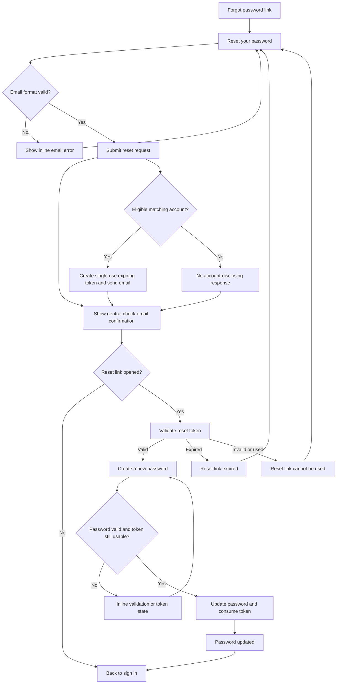

# Forgot and Reset Password Wireframes

Task: TASK-2026-01972 / UX-05
Project: PROJ-0130 abit_ai_website
Status: Draft for UX review

## Objective

Define the forgot-password and reset-password screens for the abit.ai SaaS authentication MVP. The flow must let users request reset instructions without account enumeration, validate single-use reset tokens, set a new password, and confirm success before returning to sign-in.

## Source Context

- `docs/saas-auth-mvp-scope.md`
- `docs/auth-user-flow-map.md`
- `docs/sign-in-wireframe-and-states.md`
- `docs/email-verification-resend-wireframes.md`
- `docs/auth-onboarding-ux-copy.md`
- Source brief named in ERP task: `PROJ-0130_abit_saas_auth_task_tree.md`

## Shared Recovery Layout

All password recovery screens use the same compact auth surface as sign-in. The form is single-column on mobile, centered with a constrained width on tablet and desktop, and keeps primary and secondary actions stacked at narrow widths.

```text
+--------------------------------------------------+
| abit.ai                                          |
| Recovery state title                             |
| Short operational explanation.                   |
|                                                  |
| [ Field label                                  ] |
| [ Field input                                  ] |
|                                                  |
| [ Primary action                              ] |
| Secondary action                                |
+--------------------------------------------------+
```

### Shared Rules

| Area | UX requirement |
| --- | --- |
| Account disclosure | Never reveal whether a submitted email belongs to an account, is locked, is rejected, or is otherwise ineligible. |
| Token disclosure | Do not expose whether a token is malformed, already consumed, mismatched, or tied to an ineligible account. Use generic invalid-link copy. |
| Password handling | New password fields are always blank on entry, after token errors, and after failed submission. |
| Product access | Do not show `Open workspace`, `Go to ERP`, or any equivalent product-access CTA after reset. Route through sign-in and the normal status-aware login flow. |
| Accessibility | Move focus to the status summary after request confirmation, token failure, validation error, and success. |
| Rate limits | Show cooldown-safe wording that does not disclose account existence or security internals. |

## Screen 1: Forgot Password Request

Purpose: lets a user submit an email address to request reset instructions.

```text
+--------------------------------------------------+
| abit.ai                                          |
| Reset your password                              |
| Enter your email and we will send reset          |
| instructions if the account is eligible.         |
|                                                  |
| Email address *                                  |
| [ jane@company.com                            ] |
|                                                  |
| [ Send reset instructions ]                      |
| Back to sign in                                  |
+--------------------------------------------------+
```

### Request Requirements

| Element | UX requirement |
| --- | --- |
| Title | `Reset your password` |
| Email field | Required email input with browser email keyboard support on mobile. |
| Helper copy | Use eligible-account language instead of account-found language. |
| Primary action | `Send reset instructions` |
| Return action | `Back to sign in` |
| Blocked behavior | Do not auto-create a signup request from password reset. |

### Request States

| State | Wireframe treatment | Copy |
| --- | --- | --- |
| Empty initial state | Blank email field. Primary button enabled only when client-side presence and format checks pass. | None. |
| Invalid email | Email field gets error border and inline helper. | `Enter a valid email address.` |
| Loading | Disable email, primary action, and return action if navigation would interrupt the request. Keep button height stable. | Button label: `Sending...` |
| Rate limited | Keep the user on the request screen with generic cooldown messaging. | `Please wait before requesting another reset email.` |
| Accepted | Route to the neutral confirmation screen for every accepted request path. | No account-specific copy. |

## Screen 2: Neutral Request Confirmation

Purpose: confirms the submitted request without disclosing whether the email exists, whether the account is eligible, or whether a reset email was actually sent.

```text
+--------------------------------------------------+
| abit.ai                                          |
| Check your email                                 |
| If an eligible account exists, reset             |
| instructions will be sent to that address.       |
|                                                  |
| [ Back to sign in ]                              |
| Send another reset request                       |
+--------------------------------------------------+
```

### Confirmation Requirements

| Element | UX requirement |
| --- | --- |
| Title | `Check your email` |
| Body copy | Exact neutral copy: `If an eligible account exists, reset instructions will be sent to that address.` |
| Primary action | `Back to sign in` |
| Secondary action | `Send another reset request` returns to Screen 1 with a blank email field. |
| Privacy behavior | Do not show `jane@company.com` unless product security approves echoing the submitted address. The default UX avoids echoing it. |

### Non-Disclosure Contract

The same confirmation screen and copy must be shown for:

- A known verified account.
- An unknown email address.
- An unverified access request.
- A locked, rejected, disabled, or administratively held account.
- A reset request accepted but suppressed because of rate limit, policy, or provider failure handling where the requester should not receive detail.

## Screen 3: Reset Link Validation

Purpose: shown while a reset link token is being checked before any password fields are shown.

```text
+--------------------------------------------------+
| abit.ai                                          |
| Checking reset link                              |
| Please wait while we check whether this reset    |
| link can be used.                                |
|                                                  |
| [ Validating... ]                                |
+--------------------------------------------------+
```

### Validation Requirements

| Element | UX requirement |
| --- | --- |
| Title | `Checking reset link` |
| Loading action | Disabled button or stable loading region labelled `Validating...` |
| Token handling | Validate token server-side before rendering new password fields. |
| Password fields | Do not show password fields until the token is valid, unexpired, unused, and eligible. |

## Screen 4: Set New Password

Purpose: shown only after token validation succeeds.

```text
+--------------------------------------------------+
| abit.ai                                          |
| Create a new password                            |
| Use a strong password for your abit.ai account.  |
|                                                  |
| New password *                                   |
| [ ************                                ] |
| Minimum 12 characters.                           |
|                                                  |
| Confirm new password *                           |
| [ ************                                ] |
|                                                  |
| [ Save new password ]                            |
| Back to sign in                                  |
+--------------------------------------------------+
```

### New Password Requirements

| Element | UX requirement |
| --- | --- |
| Title | `Create a new password` |
| New password field | Required password input. Password text remains hidden by default. |
| Confirm field | Required password input that must match the new password. |
| Password helper | Start with `Minimum 12 characters.` and change to validation copy only when needed. |
| Primary action | `Save new password` |
| Return action | `Back to sign in` |
| Submit behavior | On success, consume the token, invalidate active reset sessions for that token context, and route to success state. |

### New Password States

| State | Wireframe treatment | Copy |
| --- | --- | --- |
| Weak password | Inline error below new password field. | `Use at least 12 characters and avoid common passwords.` |
| Mismatched confirmation | Inline error below confirm field. | `Passwords do not match.` |
| Missing required field | Inline error below the relevant field. | `Complete this field to continue.` |
| Loading | Disable both password fields and actions. Preserve layout but clear values if the submit fails. | Button label: `Saving...` |
| Token expires during submit | Route to expired-link state. Do not update password. | See Screen 5. |
| Token fails during submit | Route to invalid-link state. Do not update password. | See Screen 6. |

## Screen 5: Expired Reset Link

Purpose: shown when the reset token was validly formed but can no longer be used because it expired.

```text
+--------------------------------------------------+
| abit.ai                                          |
| Reset link expired                               |
| This link can no longer reset your password.     |
| Request a new reset email to continue.           |
|                                                  |
| [ Send a new reset email ]                       |
| Back to sign in                                  |
+--------------------------------------------------+
```

### Expired Requirements

| Element | UX requirement |
| --- | --- |
| Title | `Reset link expired` |
| Primary action | `Send a new reset email` routes to Screen 1. |
| Return action | `Back to sign in` |
| Status behavior | Do not change password or consume unrelated valid tokens. |
| Disclosure behavior | Do not show account details or token age. |

## Screen 6: Invalid or Used Reset Link

Purpose: shown when the token is malformed, unknown, already consumed, mismatched, or otherwise cannot be used. Copy stays generic.

```text
+--------------------------------------------------+
| abit.ai                                          |
| Reset link cannot be used                        |
| We could not reset your password with this link. |
| Request a new reset email if you still need to   |
| change your password.                            |
|                                                  |
| [ Send reset email ]                             |
| Back to sign in                                  |
| Contact support                                  |
+--------------------------------------------------+
```

### Invalid-Link Requirements

| Element | UX requirement |
| --- | --- |
| Title | `Reset link cannot be used` |
| Primary action | `Send reset email` routes to Screen 1. |
| Return action | `Back to sign in` |
| Support action | `Contact support` is secondary and should not include token details in the URL or message body. |
| Status behavior | Do not change password. Keep existing account and request status unchanged. |

## Screen 7: Password Reset Success

Purpose: confirms that the password was changed and sends the user back through sign-in so normal status-aware routing applies.

```text
+--------------------------------------------------+
| abit.ai                                          |
| Password updated                                 |
| Your password has been changed. Sign in with     |
| your new password to continue.                   |
|                                                  |
| [ Back to sign in ]                              |
+--------------------------------------------------+
```

### Success Requirements

| Element | UX requirement |
| --- | --- |
| Title | `Password updated` |
| Body copy | `Your password has been changed. Sign in with your new password to continue.` |
| Primary action | `Back to sign in` |
| Routing behavior | Sign-in then routes by request status: verify-email, onboarding, review pending, more information requested, approved landing, rejected, or locked/support state. |
| Product access | Do not grant product access directly from reset success. |

## End-to-End Recovery Flow



## Copy Inventory

| State | Primary title | Primary action | Secondary action |
| --- | --- | --- | --- |
| Request | `Reset your password` | `Send reset instructions` | `Back to sign in` |
| Neutral confirmation | `Check your email` | `Back to sign in` | `Send another reset request` |
| Token validation | `Checking reset link` | `Validating...` | None |
| Set password | `Create a new password` | `Save new password` | `Back to sign in` |
| Expired link | `Reset link expired` | `Send a new reset email` | `Back to sign in` |
| Invalid or used link | `Reset link cannot be used` | `Send reset email` | `Back to sign in`, `Contact support` |
| Success | `Password updated` | `Back to sign in` | None |

## Acceptance Coverage Checklist

| Required deliverable item | Covered by |
| --- | --- |
| Forgot-password screen | Screen 1: Forgot Password Request |
| Neutral confirmation | Screen 2: Neutral Request Confirmation |
| Token validation | Screen 3: Reset Link Validation |
| New password entry | Screen 4: Set New Password |
| Expired token state | Screen 5: Expired Reset Link |
| Failed or consumed token state | Screen 6: Invalid or Used Reset Link |
| Success state | Screen 7: Password Reset Success |
| Forgot-password screen does not disclose whether the email exists | Screen 2 Non-Disclosure Contract and Request States accepted path |
| No product access from reset | Shared Rules and Screen 7 Success Requirements |

## UX Review Notes

- The reset request response intentionally uses the same confirmation for known, unknown, locked, rejected, and ineligible accounts.
- The reset success state returns users to sign-in instead of directly opening the product because login must still route by `review_status`.
- Password reset token failure copy mirrors the verification-token pattern in `docs/email-verification-resend-wireframes.md` while using password-specific actions.
- The default confirmation screen avoids echoing the submitted email to reduce shoulder-surfing and account enumeration risk.
- Final headings, labels, helper text, button text, and errors are approved in `docs/auth-onboarding-ux-copy.md`.
